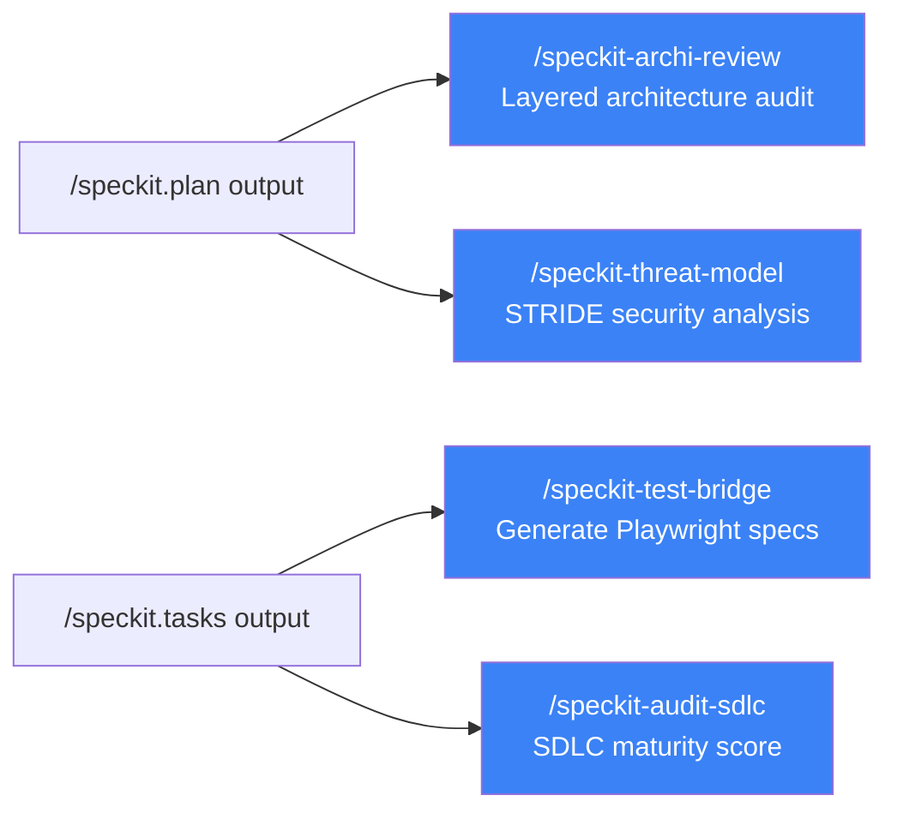

# Project Forge

[](https://opensource.org/licenses/MIT)
[](https://claude.com/claude-code)
[](https://github.com/github/spec-kit)
[](https://github.com/JimmyBlanquet/project-forge/actions/workflows/test.yml)
[](https://github.com/JimmyBlanquet/project-forge/actions/workflows/lint.yml)

> **Production-ready SaaS factory.** From `git init` to a deployed, tested, monitored product in under 48 hours.

```
$ ./tools/bootstrap my-saas --starter saas --github --vercel
✓ Cloning starter (Next.js 15 + Drizzle + Supabase Auth + Stripe)
✓ Initializing spec-kit (.specify/) with 5 PF extensions
✓ Wiring CI/CD (lint, quality, unit, e2e, build)
✓ Created GitHub repo + connected Vercel
→ /speckit.specify Add a user dashboard with revenue widgets
→ /speckit.plan && /speckit.tasks && /speckit-convert
→ /ralph-loop                           # Autonomous implementation
✓ PR opened, tests green, ready to merge
```

<sub><em>Bootstrap a SaaS, plan a feature with spec-kit, ship it autonomously with Ralph++. <a href="assets/demo.tape">Live terminal demo</a> regenerated on every release.</em></sub>

## Table of contents

- [Why Project-Forge?](#why-project-forge)
- [Who is this for?](#who-is-this-for)
- [Quick Start](#quick-start)
- [Workflow](#workflow)
- [What you get](#what-you-get)
- [Starters](#starters)
- [vs other starters / frameworks](#vs-other-starters--frameworks)
- [Ralph++ — autonomous implementation](#ralph--autonomous-implementation)
- [Migrating an existing project](#migrating-an-existing-project)
- [Tools](#tools)
- [Documentation](#documentation)
- [Contributing](#contributing)
- [Credits](#credits)
- [License](#license)

## Why Project-Forge?

Building a production-grade SaaS shouldn't take 6 weeks. Project-Forge is an opinionated factory that bundles four things that usually require months of trial-and-error to assemble cleanly:

- 🏗️ **Battle-tested starters** — Next.js 15 + Drizzle + Supabase Auth + Stripe + Tailwind 4, with shadcn/ui, Playwright E2E, vitest, jscpd, knip, eslint-sonarjs, Renovate, commitlint, husky — all wired up
- 📋 **Spec-driven development pipeline** — [GitHub spec-kit](https://github.com/github/spec-kit) for the planning layer, with five Project-Forge extensions (`pf-convert`, `pf-testing`, `pf-security`, `pf-audit`, `pf-implement`)
- 🤖 **Autonomous implementation loop** — Ralph++ runs sub-stories in parallel with quality gates (typecheck + lint + tests) and automatic PR creation
- 🛡️ **SDLC industrialization** — CI/CD, security audit, threat model, architecture review, runbooks, post-mortems, legal pages — out of the box

**Goal:** every new project starts at "production-ready Day 1" instead of "bootstrap purgatory for two weeks."

## Who is this for?

| You are… | Project-Forge gives you… |
|---|---|
| **Solo founder** shipping a SaaS MVP fast | A production starter + autonomous loop that ships features while you sleep |
| **Agency** delivering white-label SaaS to clients | A repeatable factory with consistent quality across projects |
| **Indie hacker** tired of boilerplate | One `bootstrap` command instead of two days of plumbing |
| **Tech lead** standardizing your team's SDLC | Spec-driven workflow with CI/CD, security, and audit baked in |
| **Claude Code power user** | A real-world example of skills + spec-kit + Ralph++ working together |

**Not for you if:** you want a generic Next.js starter without opinions, or you don't use Claude Code (the autonomous loop is Claude Code-native).

## Quick Start

```bash
# 1. Create a SaaS project (default starter: 'saas')
./tools/bootstrap my-app

# 2. With GitHub repo + Vercel deployment + branch protection
./tools/bootstrap my-app --starter saas --github --vercel --protect

# 3. Plan and ship your first feature (inside the new project, in Claude Code)
/speckit.specify Add a user dashboard with revenue widgets
/speckit.plan
/speckit.tasks
/speckit-convert            # tasks.md → prd.json for Ralph++
/ralph-loop                 # Ralph++ implements task-by-task with quality gates
```

That's it. The autonomous loop will commit atomically, run tests, and open a PR.

## Workflow

```mermaid
flowchart LR
    Bootstrap[<b>./tools/bootstrap</b><br/>Next.js + spec-kit<br/>+ extensions + CI/CD] --> Spec
    Spec[<b>/speckit.specify</b><br/>WHAT to build<br/>user stories + acceptance] --> Plan
    Plan[<b>/speckit.plan</b><br/>HOW to build<br/>architecture + data model] --> Tasks
    Tasks[<b>/speckit.tasks</b><br/>Break into atomic tasks] --> Convert
    Convert[<b>/speckit-convert</b><br/>tasks.md → prd.json] --> Ralph
    Ralph[<b>/ralph-loop</b><br/>Autonomous implementation<br/>parallel sub-stories<br/>quality gates] --> PR
    PR[<b>PR opened</b><br/>typecheck ✓ lint ✓ tests ✓] --> Deploy
    Deploy[<b>Vercel deploy</b><br/>after merge to main]

    style Bootstrap fill:#D97757,color:#fff
    style Ralph fill:#D97757,color:#fff
    style PR fill:#22c55e,color:#fff
    style Deploy fill:#22c55e,color:#fff
```



Optional validation extensions can run between any of the above steps:



## What you get

A project created by `./tools/bootstrap` includes:

- **spec-kit initialized** in `.specify/` with 5 PF extensions
- **spec-kit + Project-Forge extensions wired** — slash commands available in Claude Code: `/speckit.*` (planning), `/speckit-*` (PF extensions), `/ralph-loop` (autonomous implementation)
- **Quality tooling** — jscpd (duplication), knip (dead code), eslint-sonarjs (cognitive complexity), vitest (unit), Playwright (E2E), architecture fitness tests
- **CI/CD** — GitHub Actions (lint, quality, unit, e2e, build, claude-review)
- **Hooks** — `workflow-gate.sh` (blocks code without spec), `test-reminder.sh` (warns on missing tests)
- **MCP server** — Playwright (browser automation for tests)
- **Templates** — ADR, RUNBOOK, POST-MORTEM, PR template, FR legal pages (CGU/mentions/privacy)
- **Configs** — `.env.example`, `renovate.json`, `commitlint`, `husky`, Sentry triple config (client/server/edge)
- **API utilities** — error handler middleware, rate limiting, dual session+API-key auth
- **Billing pattern** — quota tracking with plan limits
- **Health check** — `/api/health` endpoint with DB ping

## Starters

| Starter | Stack | Use for |
|---|---|---|
| **`saas`** (default, recommended) | Next.js 15 + Drizzle + Supabase Auth + Stripe + Tailwind 4 | Any new project |
| **`supabase-stripe`** (legacy) | Next.js 14 + Drizzle + Supabase Auth + Stripe | Existing Supabase-first projects |
| **`saas-base`** (legacy) | Next.js 14 + Prisma + Auth.js v5 + Stripe + Resend | Existing Auth.js projects |

```bash
./tools/bootstrap --list-starters   # Full details
```

## vs other starters / frameworks

| | Project-Forge | nextjs/saas-starter | T3 Stack | create-next-app | Backstage |
|---|---|---|---|---|---|
| **Production-ready Day 1** | ✅ Yes | ⚠️ Minimal | ⚠️ Stack only | ❌ No | N/A (platform) |
| **Spec-driven workflow** | ✅ spec-kit + 5 extensions | ❌ | ❌ | ❌ | ✅ Templates |
| **Autonomous implementation** | ✅ Ralph++ | ❌ | ❌ | ❌ | ❌ |
| **CI/CD pre-wired** | ✅ Lint+Quality+Unit+E2E+Build | ⚠️ Basic | ❌ | ❌ | ✅ |
| **SDLC tooling** (audit, threat model, ADR) | ✅ Bundled | ❌ | ❌ | ❌ | ⚠️ Partial |
| **Quality gates** (jscpd, knip, sonarjs) | ✅ Configured | ❌ | ❌ | ❌ | ⚠️ Optional |
| **Legal pages** (CGU/privacy/FR) | ✅ Templates | ❌ | ❌ | ❌ | ❌ |
| **Multi-starter** | ✅ 3 starters | ❌ Single | ❌ Single | ❌ Single | N/A |
| **Claude Code-native** | ✅ Skills + commands | ❌ | ❌ | ❌ | ❌ |
| **Self-hosted, no SaaS lock-in** | ✅ | ✅ | ✅ | ✅ | ✅ Heavy infra |
| **Solo dev friendly** | ✅ One bootstrap command | ✅ | ✅ | ✅ | ❌ Enterprise scale |

**The honest take:** if you want bare metal, use `create-next-app`. If you want a clean stack, use T3. If you want enterprise template governance, use Backstage. **Project-Forge fills the gap of "I want a real SaaS, with real CI, real quality gates, real SDLC, today, alone."**

## Ralph++ — autonomous implementation

```bash
# From a PRD generated by /speckit-convert (auto-discovered in .ralph++/sessions/)
/ralph-loop

# Or via the bash script (headless, CI)
./tools/ralph --max-budget 2.00 --model sonnet
```

Ralph++ executes sub-stories from the PRD with **fresh-context agents**, applies quality gates after every story (typecheck + lint + tests), commits atomically, and creates a PR. Independent sub-stories run in parallel automatically based on the dependency graph.

Options:
- `--auto-merge` — fully hands-free: auto-merges the PR via `gh pr merge --auto --squash --delete-branch`
- `--no-parallel` — disable parallel execution (run sequentially)
- `--max-budget <usd>` — caps cost per story (default $2.00)
- `--session <id>` — pin a specific session (default: latest in `.ralph++/sessions/`)

See [`systems/ralph++/README.md`](systems/ralph++/README.md) for the full design.

## Migrating an existing project

```bash
./tools/migrate-to-speckit /path/to/your/project
```

Migrates a child project to the spec-kit + Project-Forge extensions stack. Idempotent.

## Tools

| Tool | Description |
|---|---|
| `tools/bootstrap` | Create a new project from a starter |
| `tools/ralph` | Run Ralph++ headless (CI-friendly) |
| `tools/migrate-to-speckit` | Migrate an existing project to spec-kit |
| `tools/protect-main` | Configure GitHub branch protection + auto-merge |
| `tools/install-skill` | Install a Project-Forge skill into any project |

## Documentation

- **[Architecture Decisions](docs/adr/README.md)** — ADRs documenting key choices
- **[Plans](docs/plans/)** — Migration and strategy documents
- **[Ralph++ Design](systems/ralph++/README.md)** — Full system design
- **[CLAUDE.md](CLAUDE.md)** — Instructions for Claude Code agents

## Contributing

Contributions welcome! Please read:

- **[CONTRIBUTING.md](CONTRIBUTING.md)** — Development workflow, conventional commits
- **[CODE_OF_CONDUCT.md](CODE_OF_CONDUCT.md)** — Community standards
- **[SECURITY.md](SECURITY.md)** — Reporting vulnerabilities

Open issues with the `good first issue` or `help wanted` labels are great entry points.

## Credits

Project-Forge stands on the shoulders of giants:

- **[GitHub spec-kit](https://github.com/github/spec-kit)** — Spec-Driven Development toolkit (foundation of the planning layer)
- **[nextjs/saas-starter](https://github.com/nextjs/saas-starter)** — Vercel's reference SaaS starter (basis for the `saas` starter)
- **[mickasmt/next-saas-stripe-starter](https://github.com/mickasmt/next-saas-stripe-starter)** — basis for the legacy `saas-base` starter
- **[Anthropic Claude Code](https://claude.com/claude-code)** — runtime for spec-kit commands and Ralph++ orchestration
- **[Ralph](https://github.com/snarktank/ralph)** — original loop pattern Ralph++ extends
- **[shadcn/ui](https://ui.shadcn.com)**, **[Drizzle ORM](https://orm.drizzle.team)**, **[Prisma](https://www.prisma.io)**, **[Supabase](https://supabase.com)**, **[Stripe](https://stripe.com)** — and many others bundled in the starters

## License

MIT — see [LICENSE](LICENSE).

---

<sub>Built to ship production SaaS at high velocity. Star the repo if it saved you a weekend.</sub>
